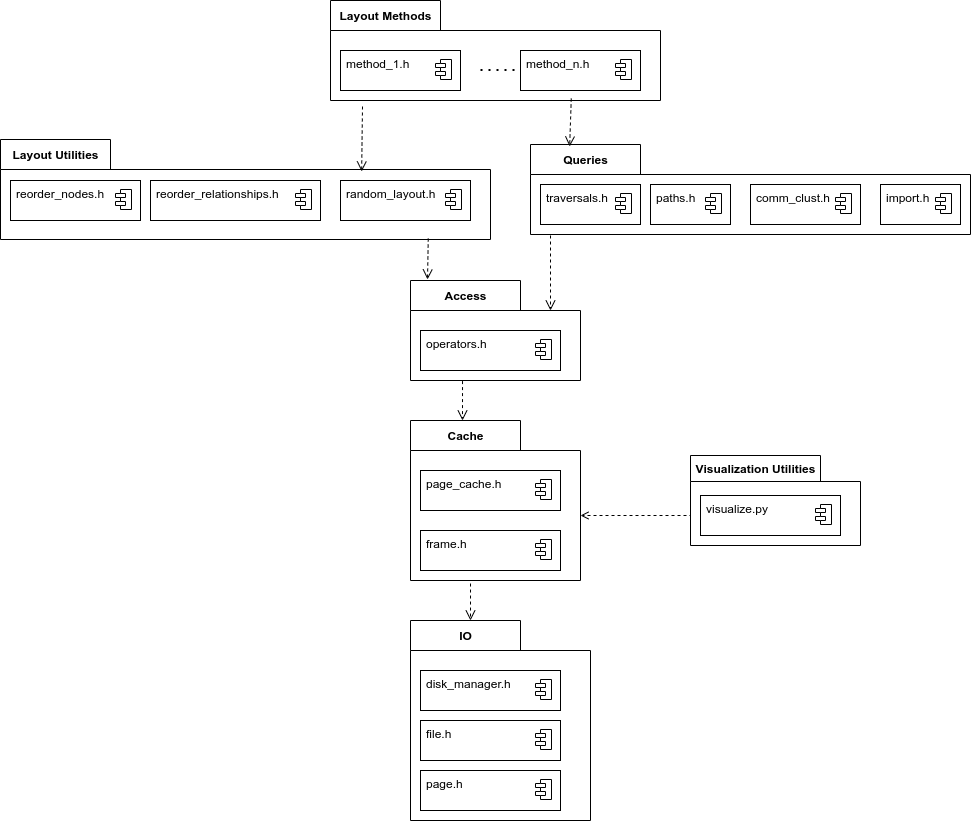

# Graph Order Evaluation Database
[](https://www.codacy.com/gh/SomeUserName1/master/dashboard?utm_source=github.com&amp;utm_medium=referral&amp;utm_content=SomeUserName1/master&amp;utm_campaign=Badge_Grade)  [](https://lgtm.com/projects/g/SomeUserName1/master/context:cpp) [](https://codecov.io/gh/SomeUserName1/master) 

The software in this repository provides an evaluation environment to experiment with the order of the graph as it is stored on disk.  
It consists of the low level components of a database with extended logging with respect to IO, several traversal-based queries, an importer for certain SNAP datasets and  utilities to change the order of the graph on disk.

## Architecture \& Source Code Organization


## Dependencies
#### Libraries
- Curl
- Zlib

#### Tools
- CMake, Ninja or Makefile (build system)
- Doxygen (documentation generation)
- Clang & LLVM (compiler)
- Clang-Tidy & Clang-Format (extended static code analysis and auto formatting)
- gcovr, llvm-cov (coverage generation and visualization)
- pprof, graphviz (profiling & visualization)
- Maven and Neo4J (benchmarks)


## Building
Create a build directory
```
mkdir build && cd build
```
Generate Makefiles
```
cmake .. -DCMAKE_BUILD_TYPE=DEBUG
```
or
```
cmake .. -DCMAKE_BUILD_TYPE=RELEASE
```
Compile the source code 
```
make
```
Alternatively, Ninja can be used instead of Makefiles. Append ```-GNinja``` to the cmake command and build with ```ninja``` instead of ```make```. Similarly ```ninja test``` needs to be used for tests then.

## Testing
After building type 
```
make test
```
To generate coverage reports run
```
./../scripts/coverage.zsh
```
You can then view the report in the web browser of you choice, e.g. with firefox
```
firefox coverage/report.html&
```

## Running
Nodes need to be accessed by the label that corresponds to the id of the nodes and relationships in the dataset. 
The ids of the database correspond to their location on disk and are thus not neccessarily consecutive and change when a record is moved.

The most important functions for evaluating the order of the graph on disk are the following ones ordered by module.

### data-struct
There is also a Fibonacci heap in the data structures, but it is only used to implement dijkstra. 
#### List-based: array\_list, linked list, linked list-based queue, linked list-based stack
Currently implemented instances are: array_list_ul, array_list_l, array_list_node, array_list_relationship, linked_list_ul, queue_ul, stack_ul. There are also inm_alist_node, inm_alist_rel which are used for in memory graphs, which are used for in memory graphs and provide direct access to the nodes stored in a dict_ul_node and dict_ul_rel in main memory.

- create: For all list-based data structures there exists a create function that takes no arguments and returns an empty instance. 
- destroy: Takes the struct as argument, handles memory release.
- size: Takes the struct as argument, retuns the number of elements currently in used.
- append: Takes the struct and an element to be appended as arguments. Inserts at the end of the list.
- insert: As append, with an additional arguments idx that is the position in the list where the element is to be inserted.
- remove: Removes the element that is currenly at the specified index in the list.
- remove elem: Iterates through the list and removes the fist occurence of the element. Linear runtime.
- index of: Given the list, an element and a pointer to a size_t variable, the function seeks through the list and stores the index to the provided size_t variable if it is contained.
- contains: Given the list and an element, this function returns a boolean indicating if the element is contained in the list.
- get: returns the element at the position in the list that was provided as argument. Leaves the element in the list.
- take (only for array_list and linked_list): Same as get, just that the element is removed from the list.
- pop (queue and stack only): For stacks it removes and returns the last element in the list. For queues it does so for the first element in the list.
- push (stack only): Same as append.
- move_back (queue only): seeks through the list for the specified element and moves it to the back. Linear runtime.


#### Hash table-based: htable, set
Currently implemented instances are: dict_ul_ul, dict_ul_int, dict_ul_d, dict_ul_node, dict_ul_rel, set_ul.

- create: As before there are functions that take no argument and return an initialized empty struct. 
- destroy: as with lists.
- size: as with lists.
- insert (for sets no value argument): Takes a pointer to an htable (or derived) struct, a key and a value of appropriate type and inserts it into the hash table.
- remove: removes the entry of a specified key from the htable
- get (htable only): Provided an instance of a hash table, a key and a pointer to an element of appropriate value type, it sets the pointer to the value of key. If the element does not exist this function returns -1 and the provided pointer remains unchanged.
- get_direct (htable only). Provided a htable and a key, it returns the value. Throws an error if the element does not exist.
- contains: Provided the htable and a key, returns true if there is an entry for that key.
- iterator create: provided a htable instance, it creates an iterator for the htable
- iterator next (key pointer only for sets): Provided an iterator, a pointer to an element of the type of the keys and a pointer to an element of the type of the values, it sets the pointers to the next element in the htable or returns -1 if all buckets and their chains have been visited.
iterator destroy: takes an iterator and releases the associated memory.


### io
Most important functions: phy_database_create, phy_database_open, phy_database_delete, phy_database_close, phy_database_swap_log_file.  
See Doxygen documentation.

### cache
Most important functions: page_cache_create, page_cache_destroy, page_cache_swap_log_file, page_cache_change_n_frames.  
see Doxygen documentation.

### access
heap_file:
- heap_file_create: Arguments are an instance of a page_cache and a path to a log file. Returns a pointer to an initialized heap_file struct.
- heap_file_destroy: Releases the memory of the specified heap_file struct
- check_record_exists: Takes a pointer to a heap_file struct, the record if, a flag indicating if the record is a node (true) or a relationship (false) and a flag indicating if the check shall be logged. returns true if the record exists.
- create node: Takes a pointer to a heap file instance, an unsigned long acting as label and a flag indicating if the creation shall be logged. returns the node id.
- create realtionship: Takes a pointer to a heap file instance, the node id of the start and end node, the weight of the edge, the label and a flag indicating if the creation shall be logged. Returns the id of the record.
- read_node & relationship: Arguments are a pointer to a heap file instance, the node/relationship id and a flag indicating if the read shall be logged. Returns a node_t*/relationship_t* with what was read from disk.
- update node and relationship: Takes a pointer to the struct, either a node_t* or a relationship_t* as record to write !with set id specifying where it shall be written! and a flag for logging.
- delete node/relationship: Deletes the record with the specified id from the database. A flag controls the logging as before. When a node is to be deleted, all relationship where the node_id occurs are delete before the node is deleted.
- get nodes/relationships: Takes a heap file instance and a flag for logging, returns an array_list_node* or array_list_relationship* containing all nodes or relationships present in the database. Linear runtime
- expand: Takes a heap file pointer, the id of a node, A direction (OUTGOING, INCOMING, BOTH) and a flag for logging. Returns an array_list_relationship* with all rels that contain the node as source or as target node or any of the two options.
- find node/relationship: provided a heap file* and a label, these functions return the first node or relationship that was found with the specified label. Linear runtime.
- heap file swap log file: as with phy_database and page_cache.

node/relationship:
- node_pretty_print: Accepts a node and prints it formated to stdio
- node_to_string: Takes a node and a char buffer and writes a human readable version of the node into the buffer
- node_copy: Takes a record and copies it into a new struct. returns node_t* or relationship_t*
- node_equals: Given two nodes/rels, compares if they are equal.


### query
the log flag control the logging at all levels. If it is set to true, the phy_database logs to its own file, the page cache to its own and the heap file to its own. The same is true for the query itself, just that for the latter a file* has to be supplied, specifying where the log from the query is written.

- bfs: Takes a heap file pointer, the start node id, the direction, if the query shall be logged and the log file to write the log of the query to. Returns a traversal_result, which consists of two dictionaries, one storing the traversal numbers and the other one the id of  the relationship which lead to the node of interest.
- dfs: as bfs
- dijksta: as bfs. Returns ans SSSP result consisting of two dictionaries (one storing doubles as values, one unsigned longs as values). The first one stores the distances, the second one the edge id that lead to the node.
- alt: before calling alt, one needs to call alt_preprocess with a heap file pointer, the direction, the number of landmarks and an array of type dict_ul_d with n_landmarks elements (uninitialized). Additionally the obligatory log flag and FILE*. After that one can call alt providing a heap file pointer, the array that was initialized with alt_preprocess, the number of landmarks, the id of the source and target node, the direction and the obligatory log flag and file*. Returns a path*, which consists of the node ids of source and target node, a double which stores the distance of the path and an array_list_ul, holding the relationship ids of the edges along the path.
- a-star: Takes a heap file*, a heuristic, the ids of source and target nodes, the direction and a flag for logging and a FILE*. returns a path as alt. 
- random_walk:  Accepts a heap file*, the start node id, the number of steps to be taken and the direction of the walk, as well as the obligatory log flag and FILE*. Returns a path (mathematically not exactly correct) that may include the same edge multiple times.
- degree: Functions to get the degree of a node, the min degree, the max degree and the average degree in the database. All functions have a heap file* as their first and the log flag and FILE* as last arguments. for the degree of a node, its id and the direction are the second and third argument. For all other calls the direction is the second argument

### order
- random_node/relationship_order: Given a hea file pointer, returns a random order (dict_ul_ul both key and values are record ids).
- swap_nodes/relationships: Given a heap_file*, two records ids and a log flag, it swaps the records on disk.
- swap pages, as with records just for whole pages. Has an additional parameter which specifies if a node or a relationship page is to be swapped.
- reorder nodes/relationships: Given a heap_file*, a dict mapping IDs to new IDs (both key and value need to be unique) and a flag for logging, it rearanges the database according to the mapping.
reorder nodes/relationships by sequence: Given a heap file and an unsigned long array that carries record ids (again each id must be unique) and a log flag, it reorders the database such that the srecords are stored in the prescribed sequence.
- reorder_relationships_by_nodes: Given a heap_file* and the log flag, it arranges the relationships such that the outgoing relationships of a node are grouped together. The groups are ordered by the same sequence as the nodes.
- sort incidence list: Sorts the incidence lists of the relationships such that the relationship with the lowest id appears first and so on. Shall avoid jumping back and forth when traversing the incidence list.


A sample main file for running the queries on the unordered graph, ordering the graph and rerunning the queries can be found in src/main.c.


## Call Graph Profiling
Build in debug mode and use the following commands to run the executable that you'd like to profile:
```
LD_PRELOAD=libprofiler.so CPUPROFILE=cpu.prof ./<executable>
pprof ./<executable> cpu.prof
```

## Documentation
To generate the documentation simply run
```
doxygen
```
from the repository root. This generates LaTeX and HTML documentations in the folders latex and html respectively.
Currently only the io and cache modules and a part of the data structures have code comments.


## TODOs
### Documentation 
- Code Comments
    - [ ] access
    - [ ] query
    - [ ] order 
    - [ ] data-struct (excl. array_list and cbs)

### Future Work
#### Basics
  - Deallocate Page (phy_database), delete_page (page_cache)
  - Bulk ops
  - Prefetching
  - Iterator for get nodes and get relationships
  - Properties
  - System Catalog 

#### Transactions & Queries
  - thread-safe data structures & locks
  - Transactions & transaction buffers
  - Pattern-based/Cypher-like QL & interpreter

#### Advanced
  - Hot and cold record layouts (hot: nodes + adj list in same file, dense & sparse matrices, cold: n4j thing)
  - Data Science QL that uses sparse matrices (Hot & Cold or Snapshots)
